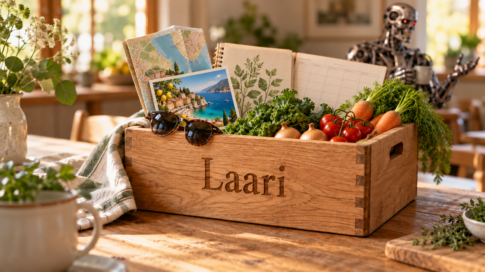

# Laari — tekoälyskillejä arjen avuksi

*Kurkkaa laariin, kun arki kaipaa apua.*

Laari on kokoelma tekoälyskillejä, eli valmiita ohjeita, joilla saat Clauden, ChatGPT:n tai Copilotin auttamaan arjen tehtävissä. Valitse alta, mitä haluat tehdä, ja seuraa käyttöönotto-ohjetta.

## Haluan reseptin suomeksi

Anna netistä löytämäsi reseptin linkki. Saat ohjeet suomeksi ja mitat tuttuina yksikköinä, esimerkiksi cupit desilitroina. Alkuperäinen linkki säilyy mukana.

- [Ota käyttöön Claudessa](docs/reseptit-claude.md)
- [Ota käyttöön ChatGPT:ssä](docs/reseptit-chatgpt.md)
- [Ota käyttöön Copilotissa](docs/reseptit-copilot.md)
- [Ota käyttöön Microsoft 365 Copilotissa](docs/reseptit-microsoft-365-copilot.md)

## Haluan suunnitella ensi viikon

Sovita viikon menot, ruoat ja treenit yhteen niin, että vapaatakin aikaa jää. Tekoäly kysyy tarvittavat tiedot ja ehdottaa suunnitelmaa.

- [Ota käyttöön Claudessa](docs/viikkosuunnittelu-claude.md)
- [Ota käyttöön ChatGPT:ssä](docs/viikkosuunnittelu-chatgpt.md)
- [Ota käyttöön Copilotissa](docs/viikkosuunnittelu-copilot.md)
- [Ota käyttöön Microsoft 365 Copilotissa](docs/viikkosuunnittelu-microsoft-365-copilot.md)

## Lisenssi

[MIT](LICENSE). Saat vapaasti käyttää, muokata ja jakaa näitä skillejä.
