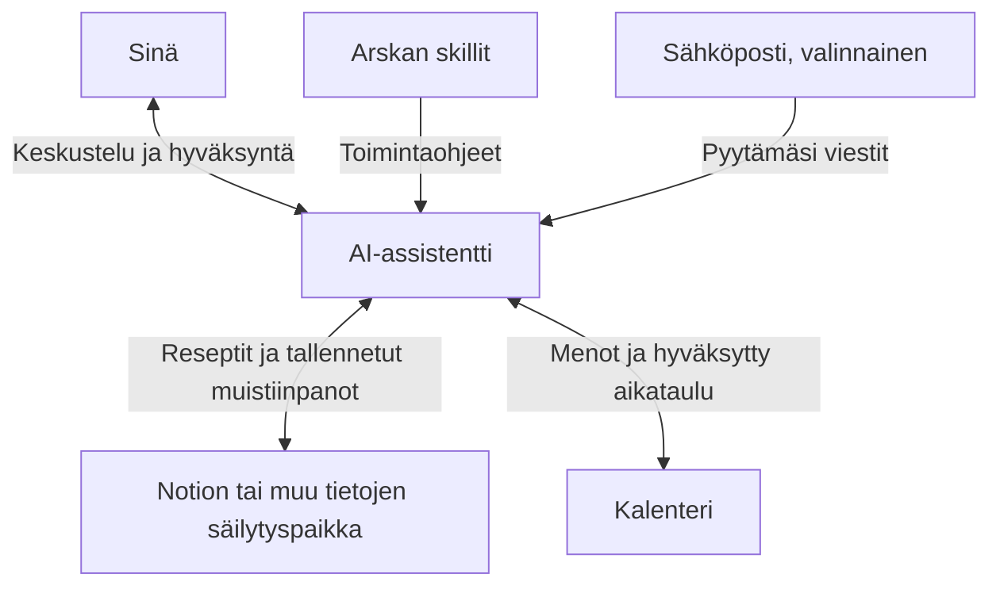

# Arska — arjen AI-assistentin skillit

*Hasta la vista, pöly.*

Arska on kasvava työkalupakki, jonka avulla voit antaa AI-assistentille tuttuja arjen tehtäviä. Skilli on valmis toimintaohje: se kertoo assistentille, miten tietty tehtävä hoidetaan ja mitä sinulta pitää kysyä.

Ensimmäinen skilli auttaa suunnittelemaan toteutettavan viikon: työ, menot, ruoat, liikunta, harrastukset, kodin rutiinit ja vapaa-aika.

Skill tarkistaa kalenterin, kysyy puuttuvat tiedot ja rakentaa luonnoksen. Kalenterimerkinnät ja kutsut tehdään vasta käyttäjän hyväksynnän jälkeen.

## Mistä Arska koostuu?

Arska toimii käyttämässäsi AI-assistentissa. Voit liittää siihen palveluja, joissa arjen tiedot jo ovat. Yksi esimerkkikokoonpano on **Claude + Notion + Google Kalenteri + Gmail**:

| Osa | Mitä se tekee? | Esimerkkipalvelu |
|---|---|---|
| AI-assistentti | Keskustelee kanssasi, lukee tarvittavat tiedot ja ehdottaa suunnitelmaa | Claude |
| Skillit | Antavat ohjeet tietyn tehtävän hoitamiseen | Arskan viikkosuunnittelu |
| Muisti ja muistiinpanot | Säilyttävät reseptit, toiveet ja erikseen tallennetut suunnitelmat | Notion |
| Kalenteri | Kertoo sovitut menot ja säilyttää hyväksytyn aikataulun | Google Kalenteri |
| Sähköposti, valinnainen | Auttaa huomioimaan viesteissä sovittuja menoja, kun pyydät sitä | Gmail |

Palvelujen yhdistäminen tarkoittaa, että annat assistentille luvan käyttää niitä. Käyttöliittymässä yhteyksiä voidaan kutsua esimerkiksi integraatioiksi, connectoreiksi tai plugineiksi. Skill ohjaa tekemistä; yhteys antaa siihen tarvittavat työkalut.

### Voinko käyttää muita palveluja?

Kyllä. Skillin ohjeet on kirjoitettu niin, etteivät ne edellytä tiettyä AI-palvelua. Niitä voi käyttää AI-työkalussa, joka osaa lukea skillin ja sen viitetiedostot. Kalenterin ja muiden palvelujen käyttö vaatii lisäksi sopivat yhteydet ja käyttöoikeudet. Tuontitapa ja käytettävissä olevat toiminnot vaihtelevat palveluittain.

Voit esimerkiksi vaihtaa AI-assistentin ja säilyttää reseptit Notionissa sekä menot samassa kalenterissa. Uudelle assistentille pitää antaa yhteydet ja ohjeet erikseen. Claude- ja ChatGPT-käyttöönotto on kuvattu [ohjeessa](docs/kayttoonotto.md); muita kokoonpanoja ei ole tässä repossa testattu.

### Miksi Notion muistiksi?

Notioniin tallennetut reseptit, listat ja muistiinpanot ovat myös sinun luettavissasi ja muokattavissasi tavallisina sivuina. Voit käyttää niitä ilman AI-assistenttia ja jatkaa samojen tietojen käyttöä assistenttia vaihtaessasi.

Notionissa on henkilökohtaiseen käyttöön ilmainen Free-taso. Siinä on rajoituksia esimerkiksi liitteille ja useamman jäsenen yhteistyölle. Notionin omat AI-ominaisuudet ovat Free-tasolla rajattu kokeilu, mutta niitä ei tarvita tähän muistiinpanojen käyttötapaan. [Notionin tasot](https://www.notion.com/pricing), [Notion AI:n kokeilu](https://www.notion.com/help/complimentary-ai-responses).

“Muisti” tarkoittaa tässä erikseen tallennettuja tietoja: keskustelut eivät automaattisesti tallennu Notioniin, eikä assistentti automaattisesti lue kaikkia sivuja. Tiedon käyttö edellyttää sopivaa yhteyttä, käyttöoikeuksia ja ohjetta siitä, mitä luetaan tai tallennetaan.

## Aloita pienestä

Ensimmäistä viikkoa varten riittävät AI-assistentti ja viikkosuunnittelun ohjeet. Voit kertoa sovitut menot ja reseptit itse. Liitä kalenteri, kun haluat käyttää sen tapahtumia ja viedä hyväksytyn suunnitelman sinne. Lisää Notion, kun haluat säilyttää reseptit ja muistiinpanot yhdessä paikassa. Sähköposti on valinnainen lisä; viikkosuunnittelu ei tarvitse sitä.

## Käyttö

**Claude:** tuo [valmis skill-ZIP](downloads/viikkosuunnittelu.zip) kohdassa Customize → Skills → + → Create skill → Upload a skill ja ota skilli käyttöön. [Clauden virallinen ohje](https://support.claude.com/en/articles/12512180-use-skills-in-claude).

**ChatGPT:** luo projekti nimeltä Arska, lisää skillin kolme Markdown-tiedostoa projektin lähteisiin ja kopioi projektiohje [käyttöönotto-ohjeesta](docs/kayttoonotto.md). Tämä käyttää tiedostoja projektin ohjeina. [ChatGPT-projektien virallinen ohje](https://learn.chatgpt.com/docs/projects).

Katso **[vaiheittaiset ohjeet ChatGPT:lle ja Claudelle](docs/kayttoonotto.md)**. Anna henkilökohtaiset asetukset ensimmäisellä käyttökerralla ja aloita: **“Suunnitellaan ensi viikko.”**

Kalenterin lukeminen ja päivittäminen edellyttää kalenteri-integraatiota. Reseptien käyttö edellyttää pääsyä käyttäjän valitsemaan reseptilähteeseen. Ilman integraatioita skill voi tehdä luonnoksen käyttäjän antamien tietojen pohjalta.

Google Kalenteri ja Notion sopivat esimerkiksi integraatioiksi, mutta skill ei edellytä tiettyä palvelua, treenisovellusta, perhemuotoa tai lemmikkiä.

Kalenteriin vieminen edellyttää myös kirjoitustoimintoja ja tarvittavia käyttöoikeuksia. Pelkkä skillin tai projektitiedostojen tuonti ei yhdistä palveluja.

## Sisältö

- [SKILL.md](viikkosuunnittelu/SKILL.md): työnkulku ja kuormituksen tarkistus.
- [Asetukset](viikkosuunnittelu/references/asetukset.md): käyttäjäkohtaiset rutiinit ja kalenterikäytännöt.
- [Ruoat](viikkosuunnittelu/references/ruoat.md): reseptien valinta, annosmäärät ja kauppalista.

Pidä oikeat nimet, sähköpostiosoitteet, kalenteri- ja tietokantatunnisteet sekä henkilökohtaiset aikataulut yksityisissä asetuksissasi. Julkaistava versio ei sisällä niitä.
